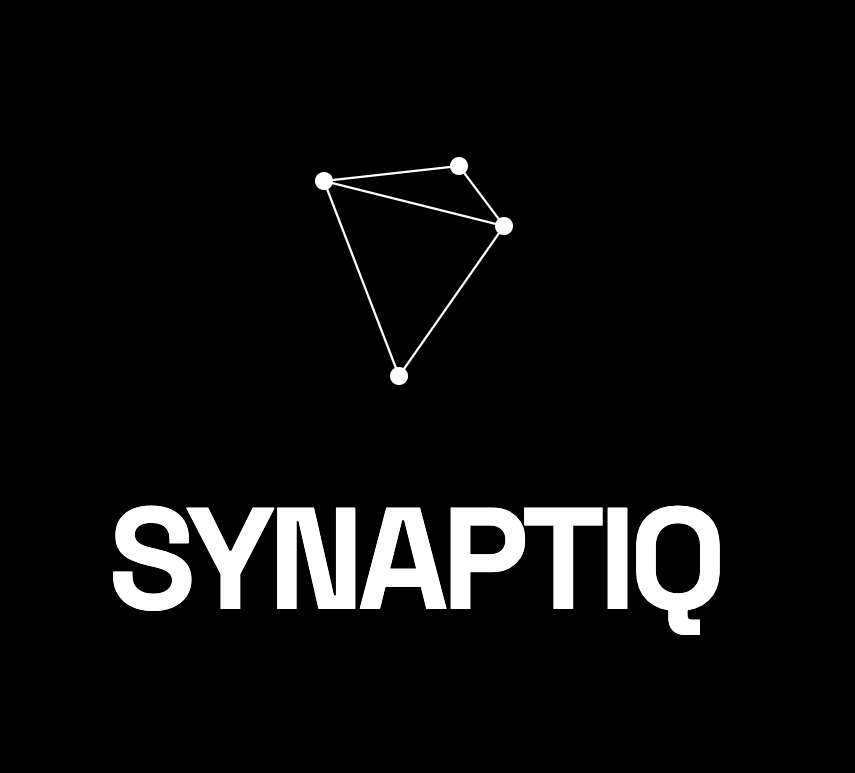
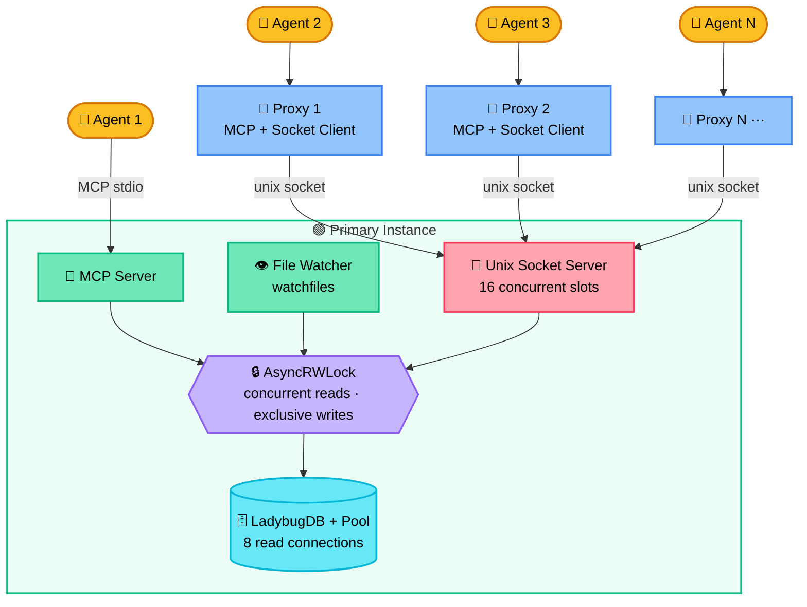
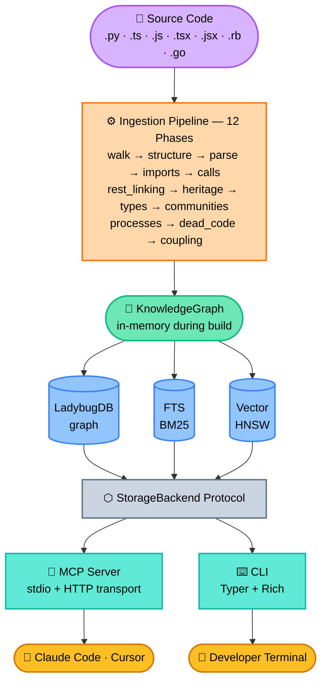

**Graph-powered code intelligence engine** — indexes your codebase into a knowledge graph and exposes it via MCP tools for AI agents and a CLI for developers.

[](https://pypi.org/project/synaptiq/)
[](https://pypi.org/project/synaptiq/)
[](LICENSE)

```
$ synaptiq analyze .

Phase 1:  Walking files...               142 files found
Phase 3:  Parsing code...                142/142
Phase 5:  Tracing calls...               847 calls resolved
Phase 7:  Analyzing types...             234 type relationships
Phase 8:  Detecting communities...       8 clusters found
Phase 9:  Detecting execution flows...   34 processes found
Phase 10: Finding dead code...           12 unreachable symbols
Phase 11: Analyzing git history...       18 coupled file pairs

Done in 4.2s — 623 symbols, 1,847 edges, 8 clusters, 34 flows
```

Most code intelligence tools treat your codebase as flat text. Synaptiq builds a **structural graph** — every function, class, import, call, type reference, and execution flow becomes a node or edge in a queryable knowledge graph. AI agents using Synaptiq don't just search for keywords; they understand how your code is connected.

---

## Why Synaptiq?

**For AI agents (Claude Code, Cursor, agent swarms):**
- *"What breaks if I change this function?"* — blast radius via call graph + type references + git coupling
- *"What code is never called?"* — dead code detection with framework-aware exemptions
- *"Show me the login flow end-to-end"* — execution flow tracing from entry points through the call graph
- *"Which files always change together?"* — git history change coupling analysis

**For developers:**
- Instant answers to architectural questions without grepping through files
- Find dead code, tightly coupled files, and execution flows automatically
- Raw Cypher queries against your codebase's knowledge graph
- Watch mode that re-indexes on every save

**Zero cloud dependencies.** Everything runs locally — parsing, graph storage, embeddings, search. No API keys, no data leaving your machine.

---

## Table of Contents

- [Features](#-features)
- [Supported Languages](#-supported-languages)
- [Installation](#-installation)
- [Quick Start](#-quick-start)
- [CLI Reference](#-cli-reference)
- [MCP Integration](#-mcp-integration)
- [Multi-Agent Concurrency](#-multi-agent-concurrency)
- [Knowledge Graph Model](#-knowledge-graph-model)
- [Architecture](#-architecture)
- [Example Workflows](#-example-workflows)
- [How It Compares](#-how-it-compares)
- [Development](#-development)

---

## 🔬 Features

### 11-Phase Analysis Pipeline

Synaptiq doesn't just parse your code — it builds a deep structural understanding through 11 sequential analysis phases:

| Phase | What It Does |
|-------|-------------|
| 1. **File Walking** | Walks repo respecting `.gitignore`, filters by supported languages |
| 2. **Structure** | Creates File/Folder hierarchy with CONTAINS relationships |
| 3. **Parsing** | tree-sitter AST extraction — functions, classes, methods, interfaces, enums, type aliases |
| 4. **Import Resolution** | Resolves import statements to actual files (relative, absolute, bare specifiers) |
| 5. **Call Tracing** | Maps function calls with confidence scores (1.0 = exact match, 0.5 = fuzzy) |
| 6. **Heritage** | Tracks class inheritance (EXTENDS) and interface implementation (IMPLEMENTS) |
| 7. **Type Analysis** | Extracts type references from parameters, return types, and variable annotations |
| 8. **Community Detection** | Leiden algorithm clusters related symbols into functional communities |
| 9. **Process Detection** | Framework-aware entry point detection + BFS flow tracing |
| 10. **Dead Code Detection** | Multi-pass analysis with override, protocol, and decorator awareness |
| 11. **Change Coupling** | Git history analysis — finds files that always change together |

### Hybrid Search (BM25 + Vector + RRF)

Three search strategies fused with Reciprocal Rank Fusion:

- **BM25 full-text search** — fast exact name and keyword matching via LadybugDB FTS
- **Semantic vector search** — conceptual queries via 384-dim embeddings (BAAI/bge-small-en-v1.5)
- **Fuzzy name search** — Levenshtein fallback for typos and partial matches

Test files are automatically down-ranked (0.5x), source-level functions/classes boosted (1.2x).

### Dead Code Detection

Finds unreachable symbols with intelligence — not just "zero callers" but a multi-pass analysis:

1. **Initial scan** — flags functions/methods/classes with no incoming calls
2. **Exemptions** — entry points, exports, constructors, test code, dunder methods, `__init__.py` public symbols, decorated functions, `@property` methods
3. **Override pass** — un-flags methods that override non-dead base class methods (handles dynamic dispatch)
4. **Protocol conformance** — un-flags methods on classes conforming to Protocol interfaces
5. **Protocol stubs** — un-flags all methods on Protocol classes (interface contracts)
6. **Ruby exemptions** — `initialize` constructors, metaprogramming hooks (`method_missing`, `inherited`, ...), `attr_*`/Rails-callback macro methods, and Rails framework base classes (`ApplicationRecord`/`ApplicationController`/...)
7. **Go exemptions** — `main`/`init` runtime entries, exported (upper-case) identifiers, and `_test.go` files (`Test*`/`Benchmark*`/`Fuzz*`/`Example*` helpers)

### Impact Analysis (Blast Radius)

When you're about to change a symbol, Synaptiq traces upstream through:
- **Call graph** — every function that calls this one, recursively (batched BFS — one query per depth level)
- **Type references** — every function that takes, returns, or stores this type
- **Git coupling** — files that historically change alongside this one

### Community Detection

Uses the [Leiden algorithm](https://www.nature.com/articles/s41598-019-41695-z) (igraph + leidenalg) to automatically discover functional clusters in your codebase. Each community gets a cohesion score and auto-generated label based on member file paths.

### Execution Flow Tracing

Detects entry points using framework-aware patterns:
- **Python**: `@app.route`, `@router.get`, `@click.command`, `test_*` functions, `__main__` blocks
- **JavaScript/TypeScript**: Express handlers, exported functions, `handler`/`middleware` patterns
- **Ruby**: Rails controller/job/mailer actions, Sinatra/Rails route blocks, RSpec `*_spec.rb` / `*_test.rb`, `Rakefile`/`config.ru`
- **Go**: `main`/`init` functions, exported package symbols, `Test*`/`Benchmark*`/`Fuzz*` functions

Then traces BFS execution flows from each entry point through the call graph, classifying flows as intra-community or cross-community.

### Change Coupling (Git History)

Analyzes 6 months of git history to find hidden dependencies that static analysis misses:

```
coupling(A, B) = co_changes(A, B) / max(changes(A), changes(B))
```

Files with coupling strength >= 0.3 and 3+ co-changes get linked. Surfaces coupled files in impact analysis.

### Watch Mode

Live re-indexing powered by a Rust-based file watcher ([watchfiles](https://github.com/samuelcolvin/watchfiles)):

```bash
$ synaptiq watch
Watching /Users/you/project for changes...

[10:32:15] src/auth/validate.py modified -> re-indexed (0.3s)
[10:33:02] 2 files modified -> re-indexed (0.5s)
```

- **File-local phases** run immediately on change — parsing happens *without* holding any lock
- **Global phases** (communities, processes, dead code) batch every 30 seconds
- The CPU-intensive parse step and the I/O-intensive storage write are split so locks are held for the shortest possible window

### Branch Comparison

Structural diff between branches using git worktrees (no stashing required):

```bash
$ synaptiq diff main..feature

Symbols added (4):
  + process_payment (Function) -- src/payments/stripe.py
  + PaymentIntent (Class) -- src/payments/models.py

Symbols modified (2):
  ~ checkout_handler (Function) -- src/routes/checkout.py

Symbols removed (1):
  - old_charge (Function) -- src/payments/legacy.py
```

---

## 🌐 Supported Languages

| Language | Extensions | Parser |
|----------|-----------|--------|
| Python | `.py` | tree-sitter-python |
| TypeScript | `.ts`, `.tsx` | tree-sitter-typescript |
| JavaScript | `.js`, `.jsx`, `.mjs`, `.cjs` | tree-sitter-javascript |
| Ruby | `.rb`, `.rake`, `.gemspec`, `.ru`, `.rbi` (+ `Rakefile`, `Gemfile`, `Guardfile`, `Capfile`, `Vagrantfile`, `Brewfile`, `Podfile`) | tree-sitter-ruby |
| Go | `.go` | tree-sitter-go |

---

## 📦 Installation

```bash
# With uv (recommended) — installs as a global CLI tool
uv tool install synaptiq

# With pip
pip install synaptiq

# As a project dependency
uv add synaptiq

# With Neo4j backend support
pip install synaptiq[neo4j]
```

Requires **Python 3.11+**.

### From Source

```bash
git clone https://github.com/scanadi/synaptiq.git
cd synaptiq
uv sync --all-extras
uv run synaptiq --help
```

---

## 🚀 Quick Start

### 1. Index Your Codebase

```bash
cd your-project
synaptiq analyze .
```

### 2. Query It

```bash
# Search for symbols
synaptiq query "authentication handler"

# Get full context on a symbol
synaptiq context validate_user

# Check blast radius before changing something
synaptiq impact UserModel --depth 3

# Find dead code
synaptiq dead-code

# Run a raw Cypher query
synaptiq cypher "MATCH (n:Function) WHERE n.is_dead = true RETURN n.name, n.file_path"
```

### 3. Keep It Updated

```bash
# Watch mode — re-indexes on every save
synaptiq watch

# Or re-analyze manually
synaptiq analyze .
```

---

## 🖥 CLI Reference

```
synaptiq analyze [PATH]          Index a repository (default: current directory)
    --full                       Force full rebuild (skip incremental)
    --embeddings MODE            lazy (default): index ready in seconds, then
                                  encode vectors in the background; sync: encode
                                  inline before returning; off: skip vectors.
                                  (--no-embeddings is a deprecated alias for off.)
    --jobs / -j N                Cap LadybugDB threads, ONNX embedding threads,
                                  and walk/parse worker pools to N (0 = explicit
                                  all-cores). See "CPU usage" below.

synaptiq status                  Show index status (incl. background embedding
                                  progress: encoding N/M, complete, deferred)
synaptiq list                    List all indexed repositories
synaptiq clean                   Delete index for current repo
    --force / -f                 Skip confirmation prompt

synaptiq query QUERY             Hybrid search the knowledge graph
    --limit / -n N               Max results (default: 20)

synaptiq context SYMBOL          360-degree view of a symbol
synaptiq impact SYMBOL           Blast radius analysis
    --depth / -d N               BFS traversal depth (default: 3)

synaptiq dead-code               List all detected dead code
synaptiq cypher QUERY            Execute a raw Cypher query (read-only)

synaptiq watch                   Watch mode — live re-indexing on file changes
synaptiq diff BASE..HEAD         Structural branch comparison

synaptiq setup                   Print MCP configuration JSON
    --claude                     For Claude Code
    --cursor                     For Cursor
    --http                       Show HTTP transport config
    --port N                     Port for HTTP config (default: 8080)

synaptiq mcp                     Start the MCP server (stdio transport)
synaptiq serve                   Start MCP server with daemon features
    --watch, -w                  Enable live file watching with auto-reindex
    --transport, -t TRANSPORT    Transport: stdio (default) or http
    --host HOST                  Host for HTTP transport (default: 127.0.0.1)
    --port PORT                  Port for HTTP transport (default: 8080)
synaptiq --version               Print version
```

### CPU usage during `analyze`

By default, `analyze` keeps LadybugDB at its library default (all cores) but caps
ONNX embedding threads to a polite `max(2, cores - 2)`, so a foreground index
doesn't lock up the rest of the machine. `--jobs N` overrides this:

| Setting | Engine threads | ONNX embed threads | Walk/parse pools |
|---------|-------------|---------------------|-------------------|
| default (no flag, no env) | all cores (library default) | `max(2, cores - 2)` | `min(8, cores)` |
| `SYNAPTIQ_DB_THREADS` / `SYNAPTIQ_EMBED_THREADS` env vars | as set | as set | unaffected |
| `--jobs N` (`N > 0`) | `N` | `N` | `N` |
| `--jobs 0` | all cores (library default) | all cores (library default) | `min(8, cores)` |

`SYNAPTIQ_DB_MEMORY_MB` caps the engine buffer pool. `SYNAPTIQ_KUZU_THREADS` /
`SYNAPTIQ_KUZU_MEMORY_MB` still work as deprecated aliases (they log a one-time
warning) for one release.

Precedence is **`--jobs` flag > environment variables > profile defaults**.
`serve`/`mcp`/`watch` are unaffected — those long-running daemons always use
the stricter "server" profile regardless of `--jobs`.

### Background embeddings (`--embeddings lazy`, default)

Encoding vectors dominates a cold index — on a large repo it can be ~98% of the
total time. By default `analyze` therefore **commits the graph first** and
returns a fully queryable index in seconds (keyword + fuzzy search work
immediately), then encodes vectors in a detached background worker that fills in
semantic search behind you.

```bash
synaptiq analyze .            # index ready in seconds; vectors fill in later
synaptiq status               # → Embeddings: encoding 12,431/26,203
                              #   …then → Embeddings: 26,203 (complete)
```

- `--embeddings sync` blocks until vectors are stored (the pre-1.x behavior).
- `--embeddings off` skips vectors entirely (`--no-embeddings` is a deprecated alias).
- The worker stays polite (`max(2, cores // 2)` ONNX threads) and never fights a
  running `serve`/`watch` daemon for the database — if the index is busy it
  defers, and the next `analyze`/rebuild encodes. `serve`/`watch` themselves
  always embed synchronously.

---

## 🤖 MCP Integration

Synaptiq exposes its full intelligence as an MCP server, giving AI agents like Claude Code and Cursor deep structural understanding of your codebase.

### Setup for Claude Code

Add to your `.claude/settings.json` or project `.mcp.json`:

```json
{
  "mcpServers": {
    "synaptiq": {
      "command": "synaptiq",
      "args": ["serve", "--watch"]
    }
  }
}
```

This starts the MCP server **with live file watching** — the knowledge graph updates automatically as you edit code. To run without watching, use `"args": ["mcp"]` instead.

Or run the setup helper:

```bash
synaptiq setup --claude
```

#### HTTP Transport

For remote or browser-based MCP clients, Synaptiq supports Streamable HTTP transport:

```bash
# Start with HTTP transport
synaptiq serve --watch --transport http --port 8080

# Get the MCP config snippet
synaptiq setup --http --port 8080
```

```json
{
  "synaptiq": {
    "url": "http://127.0.0.1:8080/mcp"
  }
}
```

#### Claude Code Skill (Optional)

For richer Claude Code integration, copy the bundled skill into your project:

```bash
cp -r "$(python -c 'import synaptiq; import pathlib; print(pathlib.Path(synaptiq.__file__).parent.parent.parent)')"/.claude/skills/synaptiq .claude/skills/
```

Or manually copy `.claude/skills/synaptiq/SKILL.md` from the [Synaptiq repo](https://github.com/scanadi/synaptiq/tree/main/.claude/skills/synaptiq). This teaches Claude when and how to use Synaptiq's tools, the knowledge graph schema, Cypher query patterns, and investigation workflows.

#### Claude Code Plugin

For a batteries-included Claude Code experience, install the [Synaptiq Claude Plugin](https://github.com/scanadi/synaptiq-claude-plugin) — it bundles the MCP server, skill, setup command, and a session hook in a single install:

```bash
claude plugins add scanadi/synaptiq-claude-plugin
```

Then run `/synaptiq:setup` to install Synaptiq, index your codebase, and configure the MCP connection automatically.

### Setup for Cursor

Add to your Cursor MCP settings:

```json
{
  "synaptiq": {
    "command": "synaptiq",
    "args": ["serve", "--watch"]
  }
}
```

Or run:

```bash
synaptiq setup --cursor
```

### MCP Tools

Once connected, your AI agent gets access to these tools:

| Tool | Description |
|------|-------------|
| `synaptiq_list_repos` | List all indexed repositories with stats |
| `synaptiq_query` | Hybrid search (BM25 + vector + fuzzy) across all symbols |
| `synaptiq_context` | 360-degree view — callers, callees, type refs, community, processes |
| `synaptiq_impact` | Blast radius — all symbols affected by changing the target |
| `synaptiq_dead_code` | List all unreachable symbols grouped by file |
| `synaptiq_detect_changes` | Map a `git diff` to affected symbols in the graph |
| `synaptiq_cypher` | Execute read-only Cypher queries against the knowledge graph |

Every tool response includes a **next-step hint** guiding the agent through a natural investigation workflow:

```
query   -> "Next: Use context() on a specific symbol for the full picture."
context -> "Next: Use impact() if planning changes to this symbol."
impact  -> "Tip: Review each affected symbol before making changes."
```

### MCP Resources

| Resource URI | Description |
|-------------|-------------|
| `synaptiq://overview` | Node and relationship counts by type |
| `synaptiq://dead-code` | Full dead code report |
| `synaptiq://schema` | Graph schema reference for writing Cypher queries |

---

## 🔄 Multi-Agent Concurrency

Synaptiq is designed for environments where multiple AI agents hit the same codebase simultaneously — Claude Code with sub-agents, Cursor with background indexing, or any swarm-of-agents setup.

### Primary/Proxy Architecture



**How it works:**

1. The first `synaptiq serve --watch` becomes the **primary** — it owns the database, runs the file watcher, and opens a Unix domain socket
2. Subsequent instances detect the lock and become **proxies** — they forward all queries through the socket to the primary
3. Role detection is automatic via `fcntl.flock()` — no configuration needed
4. If the primary crashes, the OS releases the lock and the next instance takes over

### Concurrency Model

| Layer | Mechanism | Purpose |
|-------|-----------|---------|
| **Storage reads** | Connection pool (8 `ladybug.Connection` objects) | Multiple threads query in parallel |
| **Storage writes** | Dedicated write connection + AsyncRWLock | Exclusive access during index updates |
| **MCP dispatch** | `AsyncRWLock.reader()` with 120s timeout | Concurrent tool/resource calls |
| **Socket server** | `asyncio.Semaphore(16)` backpressure | Limits concurrent proxy dispatches |
| **Socket client** | Request-ID multiplexing + `asyncio.Future` | Concurrent calls on a single connection |
| **File watcher** | Split parse/write pattern | CPU work runs lock-free; lock held only for I/O |
| **Process lock** | `fcntl.flock()` on `.synaptiq/synaptiq.lock` | Primary election, auto-released on crash |
| **Proxy recovery** | Auto-reconnect (3 attempts, exponential backoff) | Handles primary restarts gracefully |

### Lock Strategy: Write-Preferring RWLock

The `AsyncRWLock` allows multiple readers to query simultaneously while giving priority to writers:

- **Reads** (agent queries): Run concurrently — multiple agents can search, inspect context, and analyze impact at the same time
- **Writes** (file watcher updates): Get exclusive access, and pending writes block new reads to prevent writer starvation
- **Timeout**: All lock acquisitions have a 60-second timeout to prevent deadlocks
- **Split processing**: The watcher parses files *without* the lock (CPU-intensive), then acquires the write lock only for the storage I/O step

### macOS Compatibility

Unix domain socket paths are limited to 104 bytes on macOS. When the `.synaptiq/synaptiq.sock` path exceeds 100 bytes (common with deep directory nesting), Synaptiq automatically falls back to `/tmp/synaptiq-<hash>.sock` using a truncated SHA-256 hash of the data directory.

---

## 📊 Knowledge Graph Model

### Nodes

| Label | Description |
|-------|-------------|
| `File` | Source file |
| `Folder` | Directory |
| `Function` | Top-level function |
| `Class` | Class definition (incl. Go `struct`) |
| `Method` | Method within a class (incl. Go receiver funcs) |
| `Module` | Ruby module (namespace / mixin) or Go package |
| `Interface` | Interface / Protocol definition (incl. Go `interface`) |
| `TypeAlias` | Type alias (incl. Go `type X = Y` / `type X Y`) |
| `Enum` | Enumeration |
| `Community` | Auto-detected functional cluster |
| `Process` | Detected execution flow |

### Relationships

| Type | Description | Key Properties |
|------|-------------|----------------|
| `CONTAINS` | Folder -> File/Symbol hierarchy | — |
| `DEFINES` | File -> Symbol it defines | — |
| `CALLS` | Symbol -> Symbol it calls | `confidence` (0.0-1.0) |
| `IMPORTS` | File -> File it imports from | `symbols` (names list) |
| `EXTENDS` | Class -> Class it extends (incl. Go struct/interface embedding) | — |
| `IMPLEMENTS` | Class -> Interface it implements | — |
| `MIXES_IN` | Class/Module -> Ruby module it mixes in (`include`/`extend`/`prepend`) | — |
| `USES_TYPE` | Symbol -> Type it references | `role` (param/return/variable) |
| `EXPORTS` | File -> Symbol it exports | — |
| `MEMBER_OF` | Symbol -> Community it belongs to | — |
| `STEP_IN_PROCESS` | Symbol -> Process it participates in | `step_number` |
| `COUPLED_WITH` | File -> File that co-changes with it | `strength`, `co_changes` |

### Node ID Format

```
{label}:{relative_path}:{symbol_name}

Examples:
  function:src/auth/validate.py:validate_user
  class:src/models/user.py:User
  method:src/models/user.py:User.save
  file:src/auth/validate.py:
```

---

## 🏗 Architecture



### Tech Stack

| Layer | Technology | Purpose |
|-------|-----------|---------|
| Parsing | [tree-sitter](https://tree-sitter.github.io/) | Language-agnostic AST extraction |
| Graph Storage | [LadybugDB](https://ladybugdb.com/) | Embedded graph database (KuzuDB successor) with Cypher, FTS, and vector support |
| Graph Algorithms | [igraph](https://igraph.org/) + [leidenalg](https://leidenalg.readthedocs.io/) | Leiden community detection |
| Embeddings | [fastembed](https://github.com/qdrant/fastembed) | ONNX-based 384-dim vectors (~100MB, no PyTorch) |
| MCP Protocol | [mcp SDK](https://modelcontextprotocol.io/) | AI agent communication via stdio and HTTP |
| CLI | [Typer](https://typer.tiangolo.com/) + [Rich](https://rich.readthedocs.io/) | Terminal interface with progress bars |
| File Watching | [watchfiles](https://github.com/samuelcolvin/watchfiles) | Rust-based file system watcher |
| Gitignore | [pathspec](https://github.com/cpburnz/python-pathspec) | Full `.gitignore` pattern matching |

### Storage

Everything lives locally in your repo:

```
your-project/
+-- .synaptiq/
    +-- kuzu           # LadybugDB database (graph + FTS + vectors); the path
    |                  # name is retained so an index from the former KuzuDB
    |                  # backend is detected on open and rebuilt in place
    +-- meta.json      # Index metadata and stats
    +-- synaptiq.lock  # Process lock (present while serve is running)
```

Add `.synaptiq/` to your `.gitignore`.

The storage layer is abstracted behind a `StorageBackend` Protocol — LadybugDB (the actively-maintained KuzuDB successor) is the default, with an optional Neo4j backend available via `pip install synaptiq[neo4j]`.

---

## 💡 Example Workflows

### "I need to refactor the User class — what breaks?"

```bash
# See everything connected to User
synaptiq context User

# Check blast radius
synaptiq impact User --depth 3

# Find which files always change with user.py
synaptiq cypher "MATCH (a:File)-[r:CodeRelation]->(b:File) \
  WHERE a.name = 'user.py' AND r.rel_type = 'coupled_with' \
  RETURN b.name, r.strength ORDER BY r.strength DESC"
```

### "Is there dead code we should clean up?"

```bash
synaptiq dead-code
```

### "What are the main execution flows in our app?"

```bash
synaptiq cypher "MATCH (p:Process) RETURN p.name, p.properties ORDER BY p.name"
```

### "Which parts of the codebase are most tightly coupled?"

```bash
synaptiq cypher "MATCH (a:File)-[r:CodeRelation]->(b:File) \
  WHERE r.rel_type = 'coupled_with' \
  RETURN a.name, b.name, r.strength \
  ORDER BY r.strength DESC LIMIT 20"
```

### "What changed in this PR and what does it affect?"

```bash
# Structural diff
synaptiq diff main..feature

# Or pipe a git diff through detect_changes (via MCP)
git diff main | synaptiq detect-changes
```

---

## ⚖ How It Compares

| Capability | grep/ripgrep | LSP | Synaptiq |
|-----------|-------------|-----|----------|
| Text search | Yes | No | Yes (hybrid BM25 + vector) |
| Go to definition | No | Yes | Yes (graph traversal) |
| Find all callers | No | Partial | Yes (full call graph with confidence) |
| Type relationships | No | Yes | Yes (param/return/variable roles) |
| Dead code detection | No | No | Yes (multi-pass, framework-aware) |
| Execution flow tracing | No | No | Yes (entry point -> flow) |
| Community detection | No | No | Yes (Leiden algorithm) |
| Change coupling (git) | No | No | Yes (6-month co-change analysis) |
| Impact analysis | No | No | Yes (calls + types + git coupling) |
| AI agent integration | No | Partial | Yes (full MCP server) |
| Multi-agent concurrency | No | No | Yes (RWLock + connection pool) |
| Structural branch diff | No | No | Yes (node/edge level) |
| Watch mode | No | Yes | Yes (Rust-based, 500ms debounce) |
| Works offline | Yes | Yes | Yes |

---

## 🛠 Development

```bash
git clone https://github.com/scanadi/synaptiq.git
cd synaptiq
uv sync --all-extras

# Run tests (581 tests)
uv run pytest

# Run only fast unit tests (skip e2e)
uv run pytest tests/core/ tests/cli/ tests/mcp/

# Lint
uv run ruff check src/ tests/

# Format
uv run ruff format src/ tests/

# Run from source
uv run synaptiq --help
```

### Project Structure

```
src/synaptiq/
+-- cli/
|   +-- main.py                    # Typer CLI (analyze, query, serve, watch, ...)
|   +-- update_check.py            # Non-blocking PyPI update notifier
+-- mcp/
|   +-- server.py                  # MCP server (tools + resources + dispatch)
|   +-- http_transport.py          # Streamable HTTP MCP transport (Starlette + uvicorn)
|   +-- tools.py                   # Tool handler implementations
|   +-- resources.py               # Resource handler implementations
+-- core/
|   +-- ingestion/
|   |   +-- pipeline.py            # 11-phase pipeline orchestrator
|   |   +-- walker.py              # File discovery respecting .gitignore
|   |   +-- structure.py           # Folder/File hierarchy
|   |   +-- parser_phase.py        # tree-sitter AST extraction
|   |   +-- imports.py             # Import resolution
|   |   +-- calls.py               # Call tracing with confidence
|   |   +-- heritage.py            # Inheritance and implementation
|   |   +-- types.py               # Type reference extraction
|   |   +-- community.py           # Leiden clustering
|   |   +-- processes.py           # Entry point + flow detection
|   |   +-- dead_code.py           # Multi-pass dead code analysis
|   |   +-- coupling.py            # Git co-change analysis
|   |   +-- watcher.py             # File watcher with split parse/write
|   +-- storage/
|   |   +-- base.py                # StorageBackend protocol
|   |   +-- ladybug_backend.py     # LadybugDB implementation + connection pool
|   +-- daemon/
|   |   +-- rwlock.py              # Write-preferring AsyncRWLock
|   |   +-- lock.py                # fcntl.flock() based process lock
|   |   +-- socket_server.py       # Unix socket server (primary)
|   |   +-- socket_client.py       # Unix socket client (proxy)
|   +-- search/hybrid.py           # BM25 + vector + fuzzy fusion
|   +-- parsers/                   # Language-specific tree-sitter parsers
+-- config/
    +-- languages.py               # Language registry
    +-- ignore.py                  # Gitignore loading
```

See [CONTRIBUTING.md](CONTRIBUTING.md) for detailed contribution guidelines.

---

## Acknowledgments

Synaptiq was originally inspired by and built upon [axon](https://github.com/harshkedia177/axon) by [@harshkedia177](https://github.com/harshkedia177). This project has since evolved into an independent codebase with its own architecture, features, and direction.

---

## License

MIT — see [LICENSE](LICENSE).
